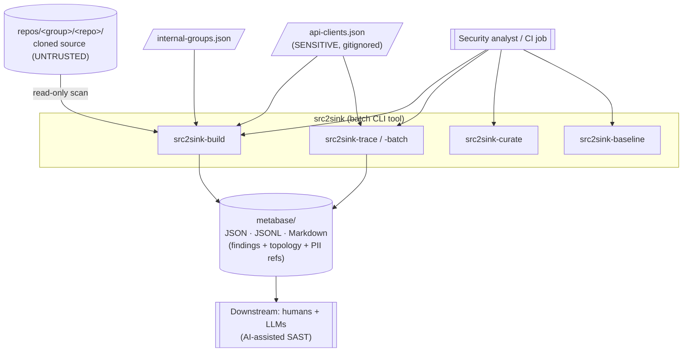
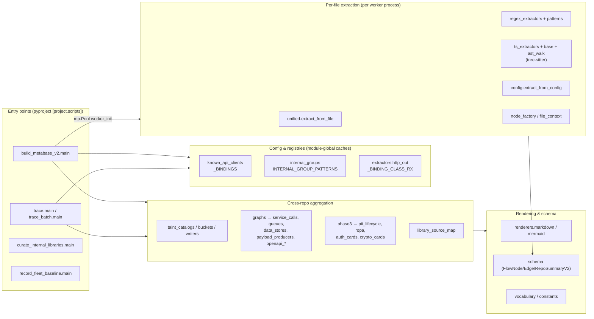
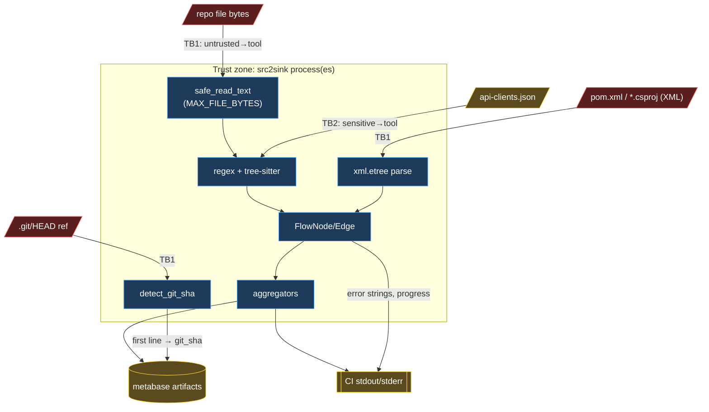
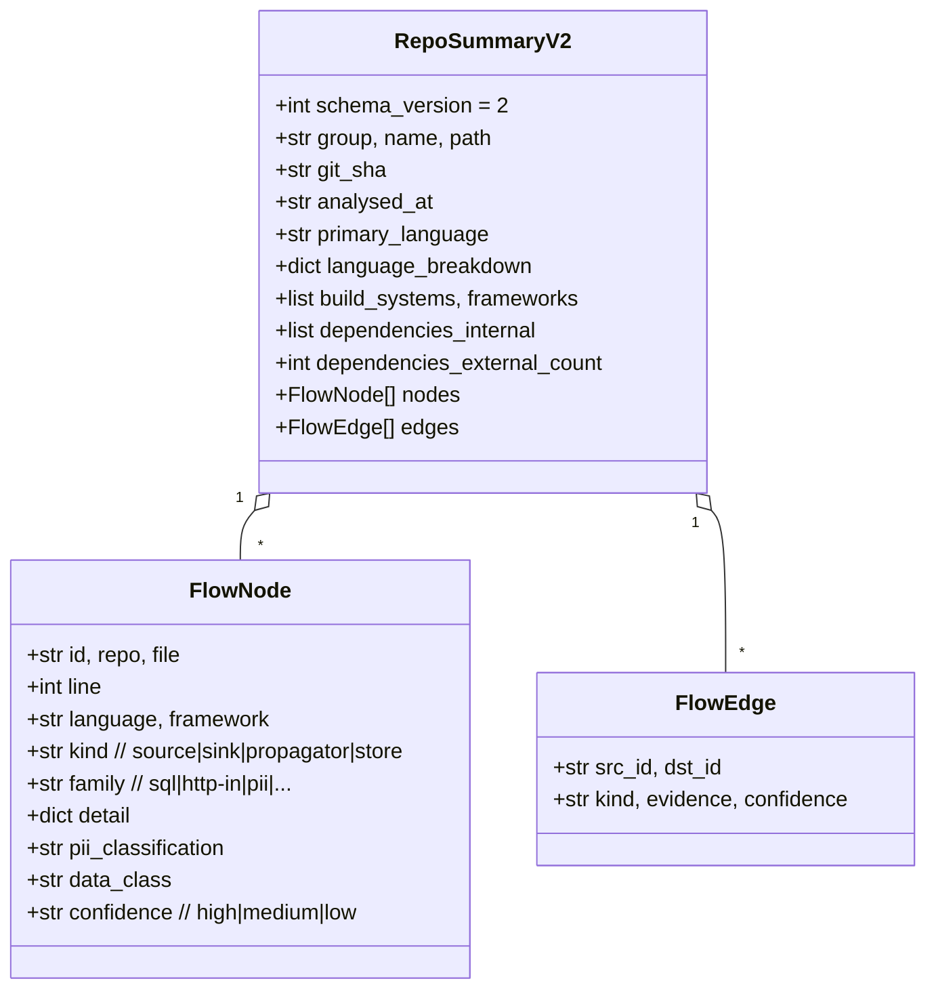

# src2sink — Architecture

> Status: baseline architecture documentation (review mode).
> Produced as step 2 of the security engineering workflow. It feeds the
> [threat model](threat-model.md) and the [secure-by-design gap
> analysis](security-privacy-gap-analysis.md). Security concerns surfaced here
> are analysed in depth in those documents; this file establishes the
> structural picture and trust boundaries.

---

## 1. Purpose & context

`src2sink` is an **offline static-analysis pipeline** that scans a fleet of
source repositories and builds a "**metabase**" — a set of machine- and
human-readable artifacts describing security-relevant *flow* (sources, sinks,
propagators, stores), cross-service call graphs, and privacy (PII/GDPR) views.
The metabase is consumed downstream by humans and LLMs for AI-assisted SAST,
data-flow reasoning, and Record-of-Processing-Activities (ROPA) projections.

It is **not** a service. It is a batch tool run from the CLI, in CI/automation,
over a directory of already-cloned repositories. It **never executes** the code
it scans (verified: no `eval`/`exec`/`subprocess`/`pickle`/`yaml.load` driven by
scanned content; the only `importlib` use loads fixed tree-sitter grammars).

### Runtime & trust context (from stakeholder input)

| Dimension | Value | Architectural consequence |
|---|---|---|
| Execution | CI / automation, also analyst workstations | Unattended; needs resource caps, output integrity, secret hygiene |
| Scanned input | Mostly first-party, **but some repos may contain malware / malicious test files** | Scanned content is **untrusted input**; must be handled defensively, ideally pre-screened |
| Config input (`api-clients.json`) | Sensitive internal topology; gitignored | Confidentiality-sensitive; must not leak to logs |
| Outputs (metabase) | Vulnerability findings + topology + PII field references | Sensitivity to be classified (see gap analysis); treat as restricted |
| Python | `>=3.14` | `os.walk(followlinks=False)` and `rglob(recurse_symlinks=False)` are the defaults — symlinked **directories** are not descended |

---

## 2. System context (C4 L1)

**External trust actors:** the *scanned repositories* are the primary untrusted
input. The *operator* is trusted. `api-clients.json` is a trusted-but-sensitive
config. The *metabase* is a produced artifact whose confidentiality matters.

---

## 3. Component decomposition (C4 L2/L3)

The package is layered by concern: **orchestration → extraction → aggregation →
rendering**, with shared **config/registry** and **schema/vocabulary** modules.

### Component specifications (key components)

**Component: `build_metabase_v2` (orchestrator)**
- **Responsibility:** Discover repos, fan out per-repo extraction across a
  multiprocessing pool, then run cross-repo aggregation.
- **Interfaces:** CLI (`src2sink-build`); reads `repos/`, config files; writes
  `metabase/`.
- **Dependencies:** every extractor and aggregator; `mp.Pool`.
- **Data owned:** per-repo `repos/<group>/<repo>.json|.md`.
- **Security boundary:** the **primary trust boundary** — untrusted repo bytes
  enter here and are parsed. Runs the pool with no per-task timeout (finding).
- **Failure mode:** per-repo exceptions are caught and recorded as `_error`
  (good). A hung/pathological file blocks its worker indefinitely (no timeout).

**Component: extraction subsystem (`extractors/*`)**
- **Responsibility:** Turn one file's bytes into `FlowNode`/`FlowEdge` facts via
  regex passes + a tree-sitter AST pass.
- **Interfaces:** `extract_from_file(repo_id, rel_path, language, source)`,
  `extract_from_config(...)`.
- **Data owned:** none (pure transform over input text).
- **Security boundary:** this is where **untrusted content meets regex engines
  and the tree-sitter C parser** — the ReDoS / parser-DoS attack surface.
- **Failure mode:** exceptions bubble to `process_one_v2`'s per-repo catch.

**Component: config registries (`known_api_clients`, `internal_groups`,
`http_out`)**
- **Responsibility:** Hold process-global configuration (API-client bindings,
  internal-coordinate patterns, client class-name regexes) loaded once per
  worker in `_worker_init`.
- **Data owned:** sensitive binding data (in memory) sourced from
  `api-clients.json`.
- **Security boundary:** module-global mutable state; re-seeded per worker
  process (spawn model on macOS). Loader **fails silent** on bad input (returns
  empty) — availability-safe but can mask misconfiguration.

**Component: aggregation subsystem (`aggregators/*`)**
- **Responsibility:** Roll per-repo JSON into taint catalogs, service/queue/data
  graphs, PII lifecycle, and ROPA projections.
- **Data owned:** all `metabase/{taint,graphs,conventions,ropa,index}` outputs.
- **Security boundary:** operates on already-produced JSON (second-order trust —
  the JSON was derived from untrusted content, so injected field names / paths
  flow through into human-readable outputs).

---

## 4. Data flow with trust boundaries (DFD)

**Trust boundaries:**
- **TB1 (untrusted → tool):** every read of repo content — the dominant attack
  surface. Controls today: `SKIP_DIRS`, `MAX_FILE_BYTES` on the main file loop,
  test-path filtering, per-repo exception isolation. Gaps: no timeout, no
  symlink-target containment, `xml.etree` used for manifests, no pre-screening.
- **TB2 (sensitive config → tool):** `api-clients.json` loaded into memory and
  its path passed to workers via `initargs`. Confidentiality concern is leakage
  into logs / error strings, not integrity.
- **TB3 (tool → outputs/logs):** field names, code snippets (truncated to
  ~100 chars), paths, and one line of `git_sha` cross into artifacts and CI
  logs. Injected content from untrusted repos flows here.

---

## 5. Core data model

`schema_version = 2` gates which per-repo JSONs the aggregators will load. PII
lifecycle and ROPA build second-order models (`PiiTouchpoint`,
`FieldLifecycleAggregate`, `RopaProcessingActivity`) from these nodes.

---

## 6. Patterns in use (assessment)

| Pattern | Where | Assessment |
|---|---|---|
| **Pipeline / phased batch** | build → extract → aggregate → render | Clear stages; good separation of concerns. |
| **Strategy (per-language extractors)** | `extractors/{java,python,...}` + dispatch in `unified` | Open-closed for new languages. |
| **Registry + global config** | `known_api_clients`, `internal_groups`, `http_out` | Works, but **module-global mutable state** re-seeded per worker; fragile under `spawn` and hard to test in isolation. Consider an injected `Config` object (dependency inversion) long-term. |
| **Worker pool (fan-out)** | `mp.Pool` + `_worker_init` | Correct use of process isolation for CPU-bound parsing. Missing: per-task timeout and a **bulkhead** against a single poisoned file. |
| **Incremental build (content hash skip)** | `detect_git_sha` vs stored SHA | Good efficiency; the SHA read is also a small attack surface (see below). |
| **Cache-aside (index caches)** | `_repo_artifact_index_cache`, `_component_identity_index_cache` | Keyed by path; fine for a batch run. Global mutable — reset needed in tests. |

---

## 7. Security-relevant architecture findings (inputs to the threat model)

These are stated here as **structural observations**; severity/likelihood and
mitigations are developed in [threat-model.md](threat-model.md).

1. **No per-file / per-parse / per-worker timeout** (`build_metabase_v2` pool;
   `ts_extractors`/`base` tree-sitter parse). A single crafted file can hang a
   worker indefinitely — the availability weakness most aligned with the
   "malicious test files" input. *Architectural fix:* a bulkhead — bounded
   per-task timeout with the offending repo recorded as `_error`.
2. **Git-HEAD symbolic-ref path traversal** (`repo_utils.detect_git_sha:220-221`):
   `repo_root/".git"/ref[5:]` with `ref` read from the untrusted `.git/HEAD`.
   A crafted `ref: ../../../../etc/passwd` yields the file's first line as
   `git_sha` in output → arbitrary single-line file read. *Fix:* containment
   check (`resolve().relative_to(repo_root/'.git')`).
3. **`xml.etree` used for manifests** (`repo_utils` pom/csproj parsing).
   `xml.etree` is documented as insecure against maliciously constructed XML
   (entity-expansion "billion laughs" DoS). *Fix:* `defusedxml` or explicit
   entity limits.
4. **Symlinked files are read** even though symlinked directories are not
   descended (Python 3.14 defaults). A symlink `x.java -> /etc/shadow` is read
   by `os.walk`/`rglob` and can flow into outputs. *Fix:* skip symlinks or
   verify the resolved target stays within the repo root.
5. **No malicious-content pre-screening.** Per stakeholder input some repos may
   hold malware/malicious test files; today everything is read and parsed with
   no indicator/quarantine step. Reassurance: the tool never *executes* scanned
   code, so this is a DoS / content-poisoning concern, not RCE.
6. **ReDoS-prone regexes** (`extractors/patterns.py` greedy `[^"']*` around
   alternations) applied to untrusted content with no timeout backstop.
7. **Confidentiality of outputs & config in CI logs.** Error strings
   (`str(exc)[:300]`) and progress prints can carry paths; `api-clients.json`
   path is passed to workers. *Fix:* log hygiene + explicit sensitivity class.

---

## 8. Key architectural decisions (ADR summaries)

### ADR-001: Process-based fan-out for extraction
**Status:** Accepted (existing). **Context:** parsing is CPU-bound; tree-sitter
releases little concurrency under the GIL. **Decision:** `mp.Pool` with
`_worker_init` re-seeding global config. **Consequences:** true parallelism;
but global-state re-seeding under `spawn`, and a **fork-bomb / heavy-fan-out
footgun** if the pool branch is entered from an unguarded `__main__` (the 900%
CPU incident originated in a test driving this path). **Security implication:**
needs a per-task timeout (bulkhead) and tests must never drive the pool branch
unguarded (already codified: keep test fixtures <4 repos / workers=1).

### ADR-002: Silent-fail config loading
**Status:** Accepted (existing). **Context:** optional config files. **Decision:**
`load_api_client_bindings` returns `()` on any error, never raises.
**Consequences:** availability-safe, but **misconfiguration is invisible** —
a malformed `api-clients.json` silently disables all binding-based edges.
**Security implication:** recommend a one-line diagnostic (count loaded /
warn on parse failure) without echoing file contents.

### ADR-003: Incremental build via git-SHA skip
**Status:** Accepted (existing). **Decision:** skip repos whose `.git` SHA
matches the stored value. **Consequences:** big speedup. **Security
implication:** the SHA read introduces the TB1 path-traversal in finding #2 —
contain the ref path.

---

## 9. Failure-mode summary

| Component | On failure | Secure? |
|---|---|---|
| One source file parse | caught per-repo → `_error` record | ✓ isolated |
| One repo | caught, run continues | ✓ |
| Pathological file (hang) | **worker blocks forever** | ✗ no timeout (bulkhead needed) |
| Bad `api-clients.json` | silently empty | ⚠ availability-safe, integrity-silent |
| Malformed XML manifest | `ET.ParseError` caught | ✓ for parse errors; ✗ for entity-expansion DoS |
| Output dir | `mkdir(parents=True, exist_ok=True)` | ✓ (names are single path components) |

---

## 10. Newly surfaced requirements (feed back to secure-by-design)

The architecture review surfaced requirements not implied by functional specs:

- **SEC-NEW-1:** Bounded resource consumption per file/repo (timeout + size +
  optional AST/degree caps) — availability under malicious input.
- **SEC-NEW-2:** Path containment for all reads derived from untrusted content
  (git ref, symlink targets).
- **SEC-NEW-3:** Hardened XML parsing for manifests.
- **SEC-NEW-4:** Malicious-content pre-screening / indicator check with
  quarantine + skip-and-record.
- **SEC-NEW-5:** Output & config sensitivity classification + CI log hygiene.
- **SEC-NEW-6:** Observability of config load (fail-loud-but-safe).

These are carried into the [gap analysis](security-privacy-gap-analysis.md) and
the [implementation plan](implementation-plan.md).

---

## Next steps in the workflow

- **Threat model** this design (STRIDE over the DFD; emphasis on TB1 malicious
  input, CI secret handling, output integrity) → [threat-model.md](threat-model.md).
- Feed **SEC-NEW-1..6** through the **secure-by-design** pass for classification
  and SRTM traceability → [security-privacy-gap-analysis.md](security-privacy-gap-analysis.md).
