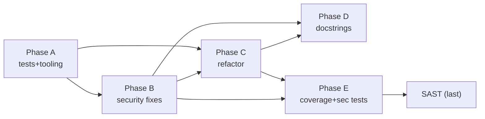

# src2sink — Consolidated Implementation & Test Plan

**Date:** 2026-07-01 · **Status:** proposed — awaiting approval before any coding.

This plan synthesizes the analysis phase into an actionable, sequenced program of
work. It answers: **what to fix first (design flaws), what to build, how to break
up the code, what tests to add to exceed 80% coverage, and in what order** so the
security fixes and the refactoring don't cause each other rework.

Sources: [architecture.md](architecture.md) · [threat-model.md](threat-model.md)
· [security-privacy-gap-analysis.md](security-privacy-gap-analysis.md) ·
[api-clients-json.md](api-clients-json.md).

---

## 0. Baseline (measured)

| Metric | Current | Target |
|---|---|---|
| Function docstring coverage | **23%** (51/213) | ≥90% of public/complex functions |
| Module docstrings | all but `src2sink/__init__.py` | 100% |
| Cyclomatic-complexity functions ≥15 | **~21** (peak cx 40) | none ≥15 (per decision: broader refactor) |
| Line coverage (measured) | **57%** (63 passed, 2 skipped) | ≥80% overall; ≥90% security modules |
| Test coverage tooling | **`pytest-cov` now wired** | gate `--cov-fail-under=80` |
| Security/privacy tests | 1 (timeout watchdog) | full `TA-001..016` set |

---

## 1. The golden rule of sequencing (why order matters)

Several **security fixes and refactor targets live in the same functions**.
Doing them in the wrong order means refactoring code, then rewriting it for the
security fix (or vice-versa). The hot examples:

| File / function | Refactor target (cx) | Security change landing here |
|---|---|---|
| `build_metabase_v2.py::main` | cx 38 | `D-1` timeout wiring, `SEC-NEW-6` config-load logging, `SEC-NEW-5b` errors |
| `build_metabase_v2.py::analyse_repo_v2` / `iter_repo_files` / `process_one_v2` | cx 22 | `D-1` bulkhead, `T-2` symlink skip, `D-4` size-gate, `SEC-NEW-4` prescreen |
| `repo_utils.py::detect_git_sha` | (low) | `T-1` path containment |
| `repo_utils.py::_build_repo_artifact_index` / `_build_component_identity_index` | cx 40 / 34 | `D-3` defusedxml, `T-2` symlink skip |
| `aggregators/taint_writers.py::write_pii_catalogues` | cx 21 | `I-4` output sanitisation, `PRV-NEW-2` snippet redaction |

**Therefore the per-module rhythm is: (1) protect with tests → (2) apply the
security fix → (3) refactor for complexity → (4) add docstrings → (5) add the
security/coverage tests.** Do this module-by-module so each module is only opened
once. This is the single most important instruction in this plan.

---

## 2. Phase A — Safety net & tooling (prerequisite, low risk)

Refactoring cx-40 functions safely requires tests that pin current behavior.

- **A1. Wire coverage.** Add `pytest-cov` (dev dep); `[tool.pytest.ini_options]
  addopts = "--cov=src2sink --cov-report=term-missing"`; establish the real
  baseline number. *(No behavior change.)*
- **A2. Characterization tests for hot paths.** Snapshot-style tests over tiny
  synthetic repos for `analyse_repo_v2`, `_build_repo_artifact_index`,
  `_build_component_identity_index`, `write_queue_graph`, `write_pii_catalogues`,
  `run_trace` — capturing today's output so later refactors are provably
  behavior-preserving. Reuse `tests/fixtures/synthetic-repos`.
- **A3. Shared test safety harness.** Promote the `tests/test_source_map_fix.py`
  pattern (SIGALRM watchdog + cache reset) into `conftest.py` as an **autouse,
  opt-outable** fixture so *no* test can ever peg the machine again, and no test
  drives the `mp.Pool` branch (fixtures stay <4 repos / workers=1).

**Exit criteria:** baseline coverage known; hot paths pinned; global watchdog in
place.

---

## 3. Phase B — Upfront architectural security fixes (do before/with refactor)

These are the "fix upfront to avoid rework" items. Grouped by the new module or
touch-point. Each ships with its `TA-xxx` test (from the gap-analysis SRTM).

### B1. Execution bulkhead — `D-1` / `SEC-NEW-1` *(Critical, design flaw)*
- **New:** `src2sink/limits.py` — a `run_with_timeout(callable, seconds)` helper
  (per-repo, using `pool.apply_async(...).get(timeout=T)` at the orchestration
  layer, plus an in-worker `faulthandler.dump_traceback_later` for diagnostics)
  and constants `PER_REPO_TIMEOUT_S`, `MAX_FILES_PER_REPO`.
- **Change:** `main`/`process_one_v2` enforce the per-repo timeout; on timeout →
  record `_error` and continue (bulkhead). `iter_repo_files` enforces the file
  cap with a logged truncation (no silent cap).
- **Test:** `TA-001`, and `TA-002/003/005` depend on this backstop existing.

### B2. Path containment — `T-1`,`T-2` / `SEC-NEW-2` *(Critical)*
- **New:** `src2sink/safe_paths.py` — `contained(child, root) -> bool` (resolve +
  `is_relative_to`) and `is_safe_symlink(path, root)`.
- **Change:** `detect_git_sha` validates the ref target is contained in
  `repo_root/.git` and matches `^[0-9a-f]{40}$|^[0-9a-f]{64}$`; `iter_repo_files`
  and the `rglob` manifest scans skip symlinked files (or require containment).
- **Test:** `TA-002` (traversal + symlink exfiltration blocked).

### B3. Hardened XML — `D-3` / `SEC-NEW-3` *(High)*
- **Dep:** add `defusedxml`. **Change:** replace `xml.etree` `ET.parse`/
  `fromstring` in `repo_utils.py` (pom/csproj) with `defusedxml.ElementTree`.
- **Test:** `TA-004` (billion-laughs does not expand).

### B4. Untrusted-content neutralisation at TB3 — `I-4` / `SEC-NEW-8` *(High, interface design)*
- **New:** `src2sink/sanitize.py` — `for_markdown(span)` (escape/fence, strip
  control chars, cap length) and a delimiter wrapper for "UNTRUSTED EXTRACTED
  CONTENT".
- **Change:** route every attacker-influenced field written to `.md`/`.jsonl`
  (`detail.snippet`, `raw`, `field_name`, path values) in `taint_writers.py`,
  `renderers/markdown.py`, and trace rendering through `sanitize.for_markdown`.
- **Test:** `TA-003` (injection string is fenced, not verbatim).

### B5. Snippet PII redaction — `PRV-NEW-2` *(High)*
- **Change:** in the same sanitisation path, mask quoted-literal / long digit
  runs before writing snippets.
- **Test:** `TA-013`, `TA-016`.

### B6. Config-load observability & log hygiene — `I-2`,`I-3` / `SEC-NEW-5b`,`6`
- **Change:** `load_api_client_bindings` (and the internal-groups loader) log
  "loaded N bindings" / a typed WARN on parse failure, **without echoing
  contents**; `process_one_v2` error records carry `type(exc).__name__` + repo
  id, not `str(exc)`/paths.
- **Test:** `TA-008`, `TA-009`.

### B7. Malicious-content pre-screen — `SEC-NEW-4` *(High, stakeholder ask)*
- **New:** `src2sink/prescreen.py` — cheap indicator checks *before* parsing
  (e.g. deny/allow globs, oversized/binary sniff, optional hash/YARA-style
  indicator list from config); suspicious files are **skipped and recorded**,
  never handed to extractors. Wire into `iter_repo_files`.
- **Test:** `TA-007`. *Design note:* the tool already never executes scanned
  content, so this is defence-in-depth against DoS/poisoning, not anti-malware
  execution protection — scope it accordingly.

### B8. Run provenance — `COMP-NEW-1` / `R-1` *(Medium)*
- **New:** emit `metabase/run-manifest.json` (tool version, args minus secrets,
  per-repo SHA, UTC timestamp — passed in, since `datetime.now`-style calls are
  fine here — and counts). **Test:** `TA-015`.

### B9. Dependency hygiene — `SC-1` / `SEC-NEW-9` *(Medium)*
- Pin + hash `tree-sitter`, grammars, `defusedxml`; add `pip-audit` (or
  `uv pip audit`) to CI. **Test/gate:** `TA-011`.

### B10. Documentation-only controls — `SEC-NEW-5`,`11` / `PRV-NEW-1`
- Add `docs/operations-security.md`: classify metabase **RESTRICTED** (access
  control + encryption at rest), `api-clients.json` **SECRET / CI secret file**,
  least-privilege CI identity + read-only `repos/` mount, and a **metabase
  retention/erasure policy**. **Verify:** `TA-010/012/014` (audit).

### B11. api-clients auto-discovery — *(in scope, per decision; feature, not a fix)*
- **New:** a discovery pass that emits candidate bindings to
  `metabase/api-clients.discovered.json` (each with `confidence` + `evidence`),
  reusing `_build_component_identity_index` for coordinate→repo resolution, and a
  `--promote-api-clients` review flow that merges accepted candidates into the
  authoritative (SECRET) `api-clients.json`. Mirrors the existing
  `--fix-source-map` pattern. **Must not** auto-merge into the authoritative
  file. See [api-clients-json.md](api-clients-json.md) §3 for the design and the
  two-pass ordering constraint. **Tests:** discovery precision on synthetic
  fixtures; promote-flow idempotency; candidate file never treated as
  authoritative. Note: candidate output inherits the TB3 sanitisation (B4) and
  the RESTRICTED/SECRET classification (B10) since it derives from untrusted
  content.

**Exit criteria:** all design-flaw findings (D-1, T-1/T-2, D-3, I-4) closed with
tests green; no `str(exc)` leakage; config load observable; auto-discovery
lands candidates only (never auto-promotes).

---

## 4. Phase C — Cognitive-complexity refactoring (behavior-preserving)

Target every function at **cx ≥ 15** (~21 functions — broader scope per
decision). Refactor *after* B has landed its changes in that function, protected
by the Phase-A characterization tests. Decomposition sketches for the worst
offenders (the cx 15–19 tail — e.g. `_locate_library_source`, `_route_node`,
`extract_tree_sitter_calls`, `_collect_repo_auth/crypto`, `write_traces_index`,
`build_ropa_activities`, `extract_from_config`, `render_trace_markdown` — gets
the same collect/render split, sketched per-function at implementation time):

| Function | cx | Decompose into |
|---|---|---|
| `repo_utils._build_repo_artifact_index` | 40 | `_index_poms()`, `_index_gradle_settings()`, `_index_package_json()` + a shared `_iter_bounded_manifests(pattern)` (already partly exists as `_iter_manifests`) — collapses the three near-duplicate rglob+depth+skip loops |
| `build_metabase_v2.main` | 38 | `_parse_args()`, `_load_config()`, `_discover_repos()`, `_run_extraction(pool_or_serial)`, `_run_aggregation()` — main becomes a thin orchestrator; also removes the pool/serial duplication |
| `aggregators.queues.write_queue_graph` | 34 | split producer-collection, consumer-collection, edge-matching, and rendering into helpers |
| `repo_utils._build_component_identity_index` | 34 | separate the "seed from shared index" / "walk simple readers" / "walk glob readers" / "gradle single-module" passes into named helpers (structure already commented) |
| `trace._scan_repos_for_literals`, `_find_upstream_from_nodes`, `_collect_target_facts` | 24/23/21 | extract per-node-family matchers; table-drive the family→handler dispatch |
| `aggregators.taint_writers.write_pii_catalogues` | 21 | one writer per catalogue section + shared row-builder (also the B4/B5 sanitisation hook point) |
| `aggregators.data_stores.write_data_store_graph`, `payload_producers._hits_from_repo_json/_scan_repos_for_binding`, `ropa.build_ropa_activities` | 17–23 | extract collection vs. rendering; table-drive store-type/hit-kind dispatch |

**Guiding pattern:** most of these are *collect → transform → render* megafunctions;
the win is separating collection from rendering and table-driving the family/kind
switches. No public signatures change; the characterization tests must stay green
byte-for-byte.

**Exit criteria:** no function ≥ cx 15; hot-path characterization snapshots
unchanged.

---

## 5. Phase D — Docstrings (23% → ≥90%)

Add docstrings module-by-module *as each module is touched in B/C* (don't make a
separate sweep — fold it into the same edit to avoid re-opening files). Priority
order: public/CLI surface first, then extraction, then aggregation, then helpers.

- **Every module:** one-line module docstring (add to `__init__.py`).
- **Every public function + every function with cx ≥ 8:** summary line + Args/
  Returns + any security-relevant note (e.g. "reads untrusted content — bounded
  by `limits.PER_REPO_TIMEOUT_S`"). Match the existing terse style already used
  in `known_api_clients.py` / `library_source_map.py`.
- Enforce with a lint gate (e.g. `ruff` `D` rules or the existing
  `complexity.py`-style AST check) so coverage doesn't regress.

---

## 6. Phase E — Test build-out to >80% + security tests

Two tracks; both use the Phase-A harness (single-process, tiny fixtures,
watchdog).

**E1. Coverage gap-fill.** From the gap analysis, ~54% of modules have no unit
tests. Prioritise by risk & complexity:
1. **Extractors** (`patterns`, `regex_extractors`, `http_out`, `ts_extractors`,
   per-language) — highest security value; unit-test each node family.
2. **Aggregators** currently only integration-tested (`taint_writers`,
   `data_stores`, `pii_flow_v2`, `service_call_*`, `openapi_*`, `phase3`).
3. **Helpers/renderers/models** (`graph_common`, `markdown`, `ropa`,
   `auth_model`, `crypto_agility`).
4. CLI-only tools (`curate_internal_libraries`, `record_fleet_baseline`,
   `trace_batch`) — at least a smoke test each.

**E2. Security & privacy tests** — implement the SRTM set: `TA-001` (bulkhead),
`TA-002` (traversal/symlink), `TA-003` (prompt-injection fencing), `TA-004`
(billion-laughs), `TA-005` (ReDoS bounded), `TA-006` (size/caps), `TA-007`
(prescreen), `TA-008/009` (config/log hygiene), `TA-013/016` (PII redaction /
no-values), `TA-015` (provenance), plus the `TA-010/012/014` audit checklist.

**Coverage gate:** raise `--cov-fail-under=80` once achieved; treat security
modules (`limits`, `safe_paths`, `sanitize`, `prescreen`) as must-be-≥90%.

**Exit criteria:** `pytest` green, coverage ≥80% overall (security modules ≥90%),
all `TA-xxx` present, full suite still completes in seconds single-process.

---

## 7. Then, and only then — SAST (`/ai-sast-scanner`)

Run the SAST scan **last**, over the hardened + refactored code, so it validates
the end state rather than code about to change. Expect it to independently
confirm (or challenge) B1–B9; triage its findings against this plan's IDs.

---

## 8. Effort, risk & dependencies



- **Highest-risk change:** B1 timeout/bulkhead (touches the pool + worker
  lifecycle). Land it behind the Phase-A characterization tests and verify
  benign-repo throughput doesn't regress (PERF-1).
- **Lowest-risk, high-value quick wins:** B3 (defusedxml swap), B6 (log hygiene),
  B2 (git-ref containment) — small, isolated, high security ROI.
- **Behavior-changing vs. behavior-preserving:** Phase B changes behavior (new
  guards) and each carries its own test; Phase C must not change behavior
  (characterization tests enforce this).

---

## 9. Resolved decisions

1. **Branch/commit strategy** — ✅ work on branch **`ES-22535`**; one focused
   commit per phase-item (B1, B2, …); review before push.
2. **Refactor depth** — ✅ **broader: cx ≥ 15** (§4 updated).
3. **api-clients auto-discovery** — ✅ **in scope** (§3 B11).
4. **New deps** — ✅ **added**: `defusedxml>=0.7.1` (runtime; PSFL), and
   `pytest-cov>=6.0.0` + `pip-audit>=2.7.0` (dev group; MIT / Apache-2.0). All
   permissive — no copyleft. Installed and verified; coverage baseline **57%**.

**Approval gate:** this plan is ready. I have not begun the coding phases —
awaiting your go-ahead to start **Phase A** (safety net & tooling).
```
