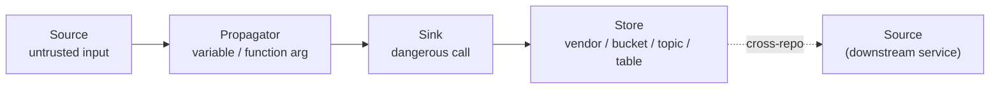
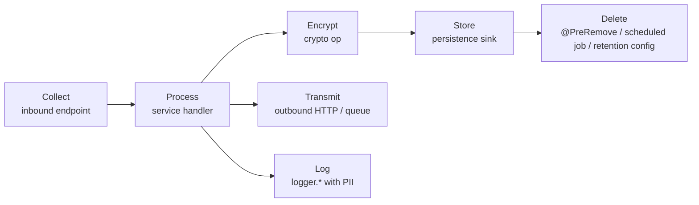
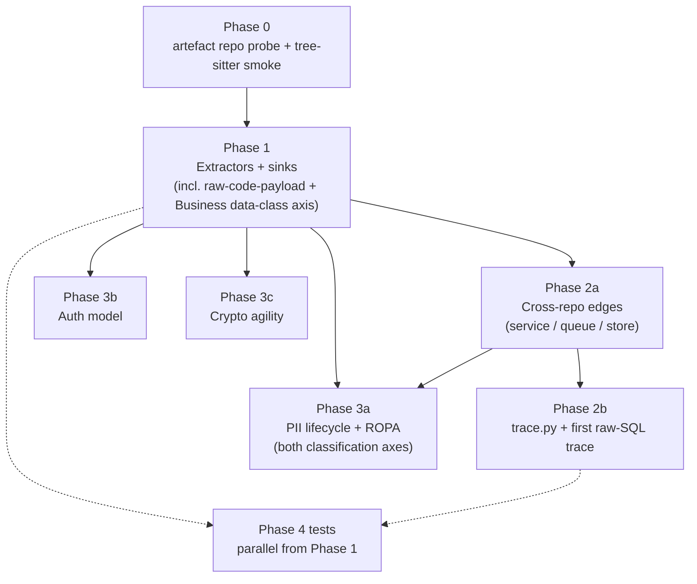

> **Archived record — not current documentation.**
> This is the planning session that produced the v2 rewrite, kept for the
> reasoning behind the design rather than as a guide to the code. It predates the
> split into this standalone repository, so its paths describe the old parent-repo
> layout: `metabase/scripts/build_metabase.py` is the v1 script this work
> replaced, and no file of that name exists here. Links to it are left broken
> deliberately — repointing them at files that never existed in this repository
> would misrepresent what was written.
>
> For the current picture see [architecture.md](architecture.md),
> [implementation-plan.md](implementation-plan.md) (the live plan and progress
> record), and [`SCHEMA.md`](../SCHEMA.md) for the vocabulary this describes
> designing. The work below shipped in 1.0.0.

## Metabase v2 — From Counts to Flow

### Why this rewrite

Audit of [metabase/scripts/build_metabase.py](metabase/scripts/build_metabase.py) against your critique:

- `sql-sinks.md` is mis-named — `SQL_PATTERNS` at lines 190–218 detects **string concatenation** (a source-side smell), not the JDBC/JPA call that executes it. So we have neither real SQL sinks nor real SQL sources.
- File I/O detection is **absent** — no `open()`, `Files.write`, `FileInputStream`, `fs.writeFile`, archive extraction, anywhere in the script.
- `http-sinks.md`, `file-sinks.md`, `pii-sinks.md` (all 3 lines each) are still the `write_starter_stubs` TODO placeholders at lines 2171–2192.
- `queue-graph.md` is 6 lines / "_(none detected)_" because the script detects Kafka/RabbitMQ/SQS/JMS/GCP Pub/Sub but never matches producer.topic → consumer.topic.
- Redis (Streams/Lists/Pub/Sub used as a queue), SNS, NATS, Azure Service Bus, ActiveMQ-specific are not in `QUEUE_PATTERNS` at all.
- `conventions/auth-models.md` is a 9-row count table of pattern labels — no per-repo model.
- `conventions/crypto-agility.md` is a 3-line TODO. `CRYPTO_PATTERNS` only matches literal algorithm strings; there is **no** detection of Secrets Manager / KMS / Vault SDKs, no detection of algorithms sourced from config.
- `pii-flow.md` is "Repos by PII classification" counts — no source-to-sink edges, no lifecycle.
- `pii-sources.md` is currently 126,716 lines / 17 MB after removing the 200/20000 caps — completely unbrowsable.
- The `JDBC_URL_PATTERN` constant at lines 2018–2021 is defined and never referenced.

The user-confirmed choices that shape this plan:

1. **Plan everything end-to-end now, ship in phases** — this document is the design + use cases + tests; PRs are sequenced.
2. **Tree-sitter for all extractors** — accept the longer timeline and artefact repository check on the wheels. Regex/heuristic-only is structurally unable to model flow, scope, or follow-imports.

---

### Use cases the new metabase must answer

These are the concrete questions a SAST run, a GDPR review, or an incident response needs to ask the metabase. Each is mapped to which new artefact answers it.

**A note on the example data type used below.** Email is the contextual-integrity norm for an email-security business (Nissenbaum's appropriate-flow baseline — collecting, routing, scanning, archiving email is what the company does), so tracing it would mostly surface noise. The illustration below uses **customer admin phone number** (`phone` / `mobile` / `phoneNumber`, already classified `direct-pii` in `PII_CLASSIFICATION` at lines 359–393). Phone is non-norm for this business, so every appearance is deliberate handling: MFA enrolment, account-recovery, billing escalation, or — the misuse case — casual logging by a developer who didn't think phone was sensitive. It exercises all seven lifecycle stages (collect / process / encrypt / store / transmit / log / delete), it triggers cross-border-transfer questions via the SMS gateway, and in MFA contexts it has Article 9 nuance. The lifecycle model itself is keyed on `classification`, so the same row template applies uniformly to every category in `PII_CLASSIFICATION` (direct-pii, sensitive, special-category-gdpr, quasi-id) — email is one row of many, not the showcase row.

| Use case                                                                                                                                                                                                                                       | Where it's answered |
|------------------------------------------------------------------------------------------------------------------------------------------------------------------------------------------------------------------------------------------------|---|
| "Show every place a customer admin's phone number is collected, processed, encrypted, stored, transmitted, logged, and deleted."                                                                                                               | `graphs/pii-lifecycle.md` (new) + per-PII-field row |
| "Which inbound endpoints in the fleet are unauthenticated, and what data do they touch?"                                                                                                                                                       | `conventions/auth-models.md` joined with `taint/pii-sinks.md` |
| "Where do we use MD5/SHA1/DES, and is each use security-relevant or identifier-only?"                                                                                                                                                          | `conventions/crypto-agility.md` per-repo card with `purpose` field |
| "What's the source of truth for each secret — env, hardcoded, AWS Secrets Manager, Vault, KMS, keystore?"                                                                                                                                      | `conventions/crypto-agility.md` "Key sources" section |
| "If service A goes offline, who breaks?"                                                                                                                                                                                                       | `graphs/service-call-graph.md` (URL template → inbound endpoint match) + `graphs/queue-graph.md` |
| "List categories of personal data, recipients (internal + third-party), and security measures — feed Article 30 ROPA."                                                                                                                         | `ropa/categories-of-personal-data.md` (new), aggregated from PII lifecycle + outbound + crypto-agility |
| "Producers and consumers of each Kafka/SQS/Redis topic."                                                                                                                                                                                       | `graphs/queue-graph.md` with producer→consumer mermaid + edge table |
| "Every place untrusted HTTP input ends up in a SQL execution call, a filesystem write, a process exec, or an outbound HTTP request."                                                                                                           | The four cross-cut **flow** files: `flows/{sql,file,exec,ssrf}.md` (new), built from source→propagator→sink chains |
| "For an endpoint that accepts raw SQL as a payload field — show me every caller in the fleet, what SQL string each caller constructs, and the downstream sink where that SQL ends up being executed."                                          | `traces/<endpoint-id>.md` (new), produced by the endpoint-anchored `metabase/scripts/trace.py` tool with a producer → endpoint → sink mermaid diagram |
| "Every endpoint anywhere in the fleet that accepts a request-body field named `sql` / `query` / `cypher` / `script` / `command` / `expression` that reaches a code-execution sink — auto-discover these without me having to know they exist." | `taint/raw-code-payload-endpoints.md` (new) — auto-discovered candidates for the trace tool above |
| "Trace a crown-jewel Organization data class (e.g. customer API key, KMS data key, scanned attachment, bearer token) through the fleet the same way I trace PII."                                                                              | Same lifecycle artefacts (`pii-lifecycle.md`, `ropa/...`) — the model is keyed on `classification`, which now has two axes: `pii_classification` (GDPR) and `data_class` (business-context-sensitive). See "Two classification axes" below. |

---

### Two classification axes — PII and Business-context

The existing `PII_CLASSIFICATION` map at lines 359–393 covers GDPR-aligned categories (direct-pii / sensitive / special-category-gdpr / quasi-id) — that stays. We add a **second, orthogonal axis** for Business-context data classes that are not PII under GDPR but are crown-jewel sensitive in the business context (Nissenbaum's contextual integrity actively *raises* the protection bar above PII norms for these).

```python
# New module-level vocabulary, parallel to PII_CLASSIFICATION
DATA_CLASS = {
    # Customer-tenant data — the whole product proposition
    "scanned-message-body":      "tenant-content",       # email message body in scan / archive flows
    "scanned-attachment":        "tenant-content",       # attachment bytes
    "scanned-url":               "tenant-content",       # URLs from scanned message
    "scanned-header":            "tenant-metadata",      # routing headers, message-id
    "customer-policy-config":    "tenant-config",        # DLP / archive / spoof policies
    "dlp-classified":            "tenant-content-classified",  # content the customer's DLP marked sensitive
    "sandbox-verdict":           "tenant-derived",       # verdict / IOCs derived from tenant content
    # Credentials / keys
    "customer-api-key":          "credential",           # tenant-issued API key
    "bearer-token":              "credential",           # session / OAuth bearer
    "refresh-token":             "credential",
    "kms-data-key":              "credential-derived",   # DEK plaintext on the wire post-KMS decrypt
    "totp-secret":               "credential",           # admin TOTP seed
    "smtp-credential":           "credential",           # outbound relay creds
    # Dangerous-payload markers (drive the trace use case below)
    "raw-sql-payload":           "dangerous-payload",    # SQL / DQL / Cypher / SOQL passed in request body
    "raw-shell-command":         "dangerous-payload",
    "raw-script-expression":     "dangerous-payload",    # JS / Python eval, expression languages
    "raw-url-template":          "dangerous-payload",    # SSRF target URL passed by caller
}
```

The two axes are independent — a single `FlowNode` may have neither, one, or both populated. For example, a request-body field named `authToken` carrying a JWT for a customer has `pii_classification=None` and `data_class="bearer-token"`; a field named `email` for billing-contact lookup has `pii_classification="direct-pii"` and `data_class=None`; a field named `customerEmailForArchiveSearch` has both.

Field-name → class detection is regex-driven exactly like `PII_FIELD_REGEX` today; the new regex `DATA_CLASS_FIELD_REGEX` matches against identifier names in request bodies, DTOs, log call arguments, and persistence sinks. Heuristic-only — false positives expected on the `tenant-content` axis (a method called `scan(...)` may not actually be scanning customer content), which is why we keep these in a `confidence`-labelled column rather than auto-promoting to findings.

### Architecture: source / propagator / sink / store

The single largest defect today is that the metabase has no vocabulary to express **flow**. Phase 1 introduces:



Every detection becomes one of four node types with shared provenance (`repo`, `file`, `line`, `language`, `framework`, `kind`, `classification`, `confidence`). Edges live separately and reference node IDs. This makes the data:

- **Queryable** (the `RepoSummary` JSON gets a `nodes[]` + `edges[]` section)
- **Renderable as flow** (mermaid generated from edges, not from counts)
- **Cross-repo joinable** (service A's outbound `url_template` matches service B's inbound `@RequestMapping` pattern)

New dataclass shape (replaces `RepoSummary` fields `sql_patterns`, `outbound_http`, `queue_io`, etc. at lines 418–441):

```python
@dataclasses.dataclass
class FlowNode:
    id: str                    # repo-scoped: f"{repo}:{file}:{line}:{kind}"
    repo: str
    file: str
    line: int
    language: str
    framework: str | None
    kind: str                  # "source" | "propagator" | "sink" | "store"
    family: str                # "sql" | "http-in" | "http-out" | "file" | "queue-pub" | "raw-code-payload" | ...
    detail: dict[str, Any]     # per-family payload (sql_dialect, http_method, topic, etc.)
    pii_classification: str | None    # direct-pii | sensitive | special-category-gdpr | quasi-id
    data_class: str | None   # scanned-message-body | customer-api-key | raw-sql-payload | ...
    confidence: str            # "high" | "medium" | "low" — heuristic stack used

@dataclasses.dataclass
class FlowEdge:
    src_id: str                # FlowNode.id
    dst_id: str
    kind: str                  # "intra-file" | "intra-repo" | "cross-repo"
    evidence: str              # the reason — e.g. "shared topic 'user.events'"
    confidence: str
```

---

### Phase 0 — Foundation (gating step, ~0.5 day)

**Goal: don't burn a week on tree-sitter only to discover artefact repository blocks half the grammars.**

1. Probe corp artefact repository for each wheel we need:
   - `tree-sitter` (Python bindings)
   - `tree-sitter-languages` (bundled grammars — covers Java, Python, JS, TS, Go, Kotlin in one wheel) **or** per-language: `tree-sitter-java`, `tree-sitter-python`, `tree-sitter-javascript`, `tree-sitter-typescript`, `tree-sitter-go`, `tree-sitter-kotlin`
   - Fallbacks if any block on artefact repository 403 / quarantine: `javalang` (Java only, regex+lexer), Python `ast` stdlib (already there), Esprima (JS), per the **artefact repository policy** — never bypass a 403.
2. Land deps in `pyproject.toml`, run `uv sync`, smoke-test by parsing one file per language into a tree-sitter AST.
3. If any grammar is blocked: stop, quote the artefact repository error, raise the lifecycle ticket, defer that language to a Phase 1.5 once cleared.

**Exit gate**: tree-sitter parses one file per supported language, recorded as a 30-line smoke test under `metabase/tests/test_phase0_smoke.py`.

---

### Phase 1 — Vocabulary fix + extractor breadth (~3 days)

**Goal: every detection emits a `FlowNode` with the correct kind. The six taint files become real catalogues.**

#### 1a. New module layout

Split [metabase/scripts/build_metabase.py](metabase/scripts/build_metabase.py) (currently ~2200 lines) into:

```
metabase/scripts/
  build_metabase.py            # CLI entry, orchestrates phases
  schema.py                    # FlowNode, FlowEdge, RepoSummary v2 dataclasses
  extractors/
    __init__.py
    base.py                    # Extractor protocol + tree-sitter helpers
    java.py                    # tree-sitter-java queries
    kotlin.py                  # tree-sitter-kotlin queries (fallback: regex)
    python.py                  # tree-sitter-python queries
    javascript.py              # tree-sitter-javascript + typescript
    go.py                      # tree-sitter-go queries
    config.py                  # YAML, .properties, .env, gradle.properties, Helm
  aggregators/
    __init__.py
    service_calls.py           # URL template → inbound endpoint match
    queues.py                  # topic-name producer/consumer match
    data_stores.py             # JDBC URL parsing, Mongo URI, S3 bucket discovery
    taint_catalogs.py          # per-family catalogue renderer (hierarchical)
  models/
    __init__.py
    pii_lifecycle.py           # collect / process / encrypt / store / transmit / log / delete
    auth_model.py              # per-repo auth model class
    crypto_agility.py          # per-repo crypto-agility model class
    ropa.py                    # GDPR Article 30 view, derived from above
  renderers/
    __init__.py
    markdown.py                # markdown emission with hierarchical summarisation
    mermaid.py                 # flow / call / queue / pii-lifecycle diagrams
```

#### 1b. Extractor coverage per family

Each row below replaces a known gap. The "produces" column is the dataclass family used by aggregators downstream.

- **SQL**
  - Sinks: `Statement.execute*`, `PreparedStatement.execute*`, `JdbcTemplate.{query,update,batchUpdate}`, `NamedParameterJdbcTemplate.*`, `EntityManager.{createQuery,createNativeQuery}.{getResultList,executeUpdate}`, JPA repository `save/saveAll/delete*/find*ByExample*`, jOOQ `DSL.execute`, MyBatis mapper invocations, Spring Data `@Query`. JS/TS: `pg.query`, `mysql.query`, `mongoose.Model.{find,save,deleteOne,aggregate}`, `prisma.<model>.{create,update,delete,findMany}`, raw `knex.raw`, `sequelize.query`. Python: `cursor.execute*`, `session.execute`, SQLAlchemy Core `engine.execute`, SQLAlchemy ORM `session.{add,delete,query,scalar}`, Django ORM `.objects.{create,filter,update,delete}`, raw `connection.cursor`. Go: `database/sql.{Exec,Query}`, GORM `db.{Create,Save,Delete,Where,Raw}`, sqlx. **Produces**: `FlowNode(kind="sink", family="sql", detail={"dialect":..., "parameterised": bool})`
  - Sources for the SQL family: string-builder/concat/interpolation that reaches the sink within scope (this is the current `SQL_PATTERNS` heuristic, now correctly labelled `kind="source"`).
- **File I/O** (entirely new)
  - Java: `Files.{write,writeString,delete,deleteIfExists,move,copy}`, `FileOutputStream`, `FileWriter`, `BufferedWriter`, `RandomAccessFile.write`, `ZipInputStream.getNextEntry` (Zip Slip), `TarArchiveInputStream`, Apache Commons `FileUtils.{write,delete}`.
  - Node: `fs.{writeFile,writeFileSync,createWriteStream,unlink,rename,rmdir}`, `fs.promises.*`, `tar.x`, `unzipper.Parse`.
  - Python: `open(..., 'w'|'a')`, `pathlib.Path.{write_text,write_bytes,unlink,rename}`, `shutil.{copy,move,rmtree}`, `tarfile.open(..., 'w')`, `zipfile.ZipFile(..., 'w')`, `os.remove`, `os.rename`.
  - Go: `os.{Create,Remove,Rename}`, `ioutil.WriteFile`, `archive/tar.NewWriter`, `archive/zip.OpenReader.File.Open`.
  - **Produces**: `FlowNode(kind="sink", family="file", detail={"op":"write|delete|extract|rename", "path_from_input": bool})`
- **HTTP outbound** (currently only client-call detection)
  - Extend Python clients: `httpx.{get,post,...}`, `aiohttp.ClientSession.{get,post,...}`, `urllib.request.urlopen`, `requests.Session.send`.
  - Tag each sink by **purpose**: `client-call`, `url-construction` (templating but not invoked here), `redirect` (response.send_redirect / `res.redirect`), `webhook-callback`.
  - **Produces**: `FlowNode(kind="sink", family="http-out", detail={"method":..., "url_template":..., "purpose":...})`
- **PII sinks** (entirely new)
  - Storage sinks: JPA `save/persist`, JdbcTemplate inserts, Mongo `insertOne/save`, S3 `putObject`, DynamoDB `putItem`, ElasticSearch `index`.
  - Log sinks: `Logger.{info,warn,error,debug}` calls whose argument list contains a known PII-classified identifier (cross-reference against `pii_fields`).
  - Third-party SDK sinks: AWS SES `sendEmail`, SendGrid `mail.send`, Twilio `messages.create`, Mailgun, Segment `track`, Mixpanel, Datadog log API.
  - **Produces**: `FlowNode(kind="sink", family="pii-storage|pii-log|pii-external")` with `classification` populated.
- **Crypto** (split into two new sub-families)
  - Existing literal algorithm detection stays, retagged `family="crypto-algorithm"`.
  - **New**: Secrets manager / KMS clients
    - AWS: `SecretsManagerClient.getSecretValue`, `KmsClient.{encrypt,decrypt,generateDataKey}`, `AWSSimpleSystemsManagement.getParameter` (Parameter Store).
    - HashiCorp Vault: `Vault.{logical().read,logical().write}`, `VaultTemplate.opsForKey`.
    - GCP: `SecretManagerServiceClient.accessSecretVersion`, `KeyManagementServiceClient.{encrypt,decrypt}`.
    - Azure: `SecretClient.getSecret`, `KeyClient.{getKey,createKey}`, `CryptographyClient.{encrypt,decrypt}`.
  - **New**: algorithms sourced from config — match config-key names like `app.crypto.algorithm`, `tls.ciphers`, `jwt.signing-algorithm`, then resolve to the YAML/properties value in the same repo to record the actual algorithm string.
  - **Produces**: `FlowNode(kind="propagator|sink", family="crypto-algorithm|crypto-key-source|crypto-config")`.
- **Auth** (currently only label counts)
  - In addition to the existing label patterns, extract:
    - Spring Security `SecurityFilterChain` builders → enumerate matchers and their auth posture per pattern.
    - JWT setup: `JwtParser.setSigningKey`, `Jwts.parserBuilder().setSigningKey`, `JWTDecoder` (Auth0), `python-jose.jwt.decode`. Capture the **key source** (literal / env / secret-manager).
    - OAuth/OIDC client registrations: `ClientRegistration.withRegistrationId`, `oauth2_client` config blocks, OpenID Connect filter chains.
    - MFA hooks: presence of `TotpVerifier`, `WebAuthn`, `DuoSecurityClient`, `AuthyClient`, custom `step-up-authentication` filters.
    - Password storage: `BCryptPasswordEncoder`, `Argon2PasswordEncoder`, `PBKDF2PasswordEncoder`, `MessageDigestPasswordEncoder` (red flag).
    - Session model: `HttpSession` usage vs JWT vs Spring `RedisOperationsSessionRepository`.
  - **Produces**: per-repo `AuthModel` (see Phase 3).
- **Raw-code-payload endpoints** (entirely new — drives the trace use case)
  - Detect any inbound endpoint whose request-body schema or `@RequestBody` / `BaseModel` / Pydantic / Joi field is named one of: `sql`, `query`, `dql`, `cypher`, `soql`, `statement`, `where`, `filter`, `expression`, `script`, `command`, `code`, `eval`, `program`, `template`, `condition`, `predicate`, `jsonpath`, `xpath`, `jq`.
  - For each candidate, traverse the handler's AST to confirm the field reaches a code-execution sink in the same family (SQL → `executeQuery` / `JdbcTemplate.query` etc.; shell → `Runtime.exec` / `ProcessBuilder`; script → `ScriptEngine.eval` / `eval()` / `exec()` / `pyparsing`).
  - Confirmed candidates: `FlowNode(kind="source", family="raw-code-payload", data_class="raw-sql-payload"|"raw-shell-command"|"raw-script-expression"|"raw-url-template")`. Plus an `endpoint_id` so the trace tool can anchor on it.
  - Unconfirmed (field name matches but no in-handler sink): still emitted with `confidence="low"` and a `needs-review` flag — these are the false-positive bucket the user can skim.
  - **Output**: `taint/raw-code-payload-endpoints.md` listing every confirmed and unconfirmed endpoint with its `endpoint_id`, the field name, the resolved sink, and a "trace it" command line.
- **Queues** (extend `QUEUE_PATTERNS`)
  - Redis as a queue: `redisTemplate.opsForStream().add`, `XADD`/`XREAD`/`XGROUP` commands, `redis.pubsub`, `RPUSH`/`BLPOP`.
  - SNS: `SnsClient.publish` (extract `topicArn`).
  - NATS: `nc.publish`, `nc.subscribe`, `JetStream.publish`.
  - Azure Service Bus: `ServiceBusSenderClient.sendMessage`, `ServiceBusProcessorClient`.
  - ActiveMQ-specific: `JmsTemplate` with `org.apache.activemq` configuration.
  - **Produces**: `FlowNode(kind="sink", family="queue-pub", detail={"system":..., "topic":...})` and `kind="source", family="queue-sub"`.

#### 1c. Output: the six taint files become real

Hierarchical summarisation (fixes the 17 MB `pii-sources.md`):

```
# Top section — distinct families × repos
| Family | Repos affected | Distinct identifiers | Total occurrences |
| email  | 78             | 12                   | 4,217             |
| ...

# Per-family drill-down — first N repos by occurrence
| Repo | Identifiers | Locations |
| acme/user-api | email, given_name, ... | <n> → see sidecar |

# Tail summary
"_178 additional repos with ≤10 occurrences each — see `taint/pii-sources.jsonl` for the raw stream._"
```

Full data goes into a `.jsonl` sidecar alongside the `.md`, so SAST tooling has the firehose and humans have a browsable view. **No more 17 MB markdown.**

---

### Phase 2 — Cross-repo edges + endpoint-anchored tracing (~3 days)

**Goal: the graphs/ files show real edges between services, and we ship a CLI that produces a complete trace for any endpoint.**

- `graphs/service-call-graph.md` — for each outbound HTTP node with a `url_template`, attempt to match against every other repo's `inbound_endpoints` patterns. Emit edges as:
  - `(repoA → repoB)` confidence=high if hostname literal matches a known service-name + an inbound path template
  - confidence=medium if hostname is templated from config and inbound matches
  - confidence=low for fallback
  - Output: mermaid diagram of edges + a per-edge table with `confidence`, `evidence`, `(src_file:line, dst_file:line)`. A "broken edges" appendix lists outbound URLs with no matching inbound (likely third-party).
- `graphs/queue-graph.md` — group nodes by `family ∈ {queue-pub, queue-sub}` and `detail.topic`. Producer → consumer edges drawn whenever the same `topic` string is observed in opposing direction. Orphan topics (producer with no consumer, or vice versa) get a "Broken / unowned topics" appendix — frequently a real bug.
- `graphs/data-store-graph.md` — actually use `JDBC_URL_PATTERN` (currently defined-but-unreferenced at lines 2018–2021). Add `MONGODB_URI_PATTERN`, `REDIS_URL_PATTERN`, S3 bucket discovery from `BucketName(...)` arguments. Group repos by vendor + database name + bucket. Output: per-vendor section with the list of repos that read from / write to each store.
- **`metabase/scripts/trace.py` — endpoint-anchored bidirectional flow query (new)**
  - Invocation:
    ```sh
    python metabase/scripts/trace.py --endpoint acme/sql-runner-api:src/main/java/.../SqlRunnerController.java:42
    # or by family
    python metabase/scripts/trace.py --family raw-code-payload    # trace every raw-SQL endpoint
    ```
  - **Upstream pass (producers):** uses the Phase-2 service-call edges to find every outbound HTTP node in the fleet whose `url_template` matches the target endpoint's inbound pattern. For each match, walks the AST of the calling function within ±N lines of the HTTP call to characterise what each producer puts in the SQL field:
    - **Literal string** — hardcoded SQL, captured verbatim (often still problematic if it carries embedded user input via `String.format` style)
    - **Concatenation** of literal + variable — capture the literal anchors and the variable identifiers
    - **Config read** — variable sourced from `@Value("${...}")` / `application.yml` lookup → record the config key
    - **Request input** — variable sourced from the producer's own inbound endpoint's `@RequestBody` / `@RequestParam` → **critical**, this is request input being forwarded as SQL to a downstream service
    - **Unknown** — variable's origin not resolvable within the function (defer to caller — produces a `partial` trace with a clearly-flagged unresolved leg rather than silently terminating)
  - **Downstream pass (sinks):** walks the target endpoint's handler AST to find the SQL execution sink the field reaches. Records: the sink's method (`JdbcTemplate.query`, `EntityManager.createNativeQuery.executeUpdate`, etc.), the resolved datasource bean / config key, the parameterisation posture (raw concat vs `?` binding — always `parameterised=False` for this family by construction), and the DB credentials source (env / KMS / Vault / hardcoded).
  - **Output**: one markdown file per traced endpoint, written to `metabase/traces/<endpoint-id-slug>.md`:
    ```markdown
    # Trace: acme/sql-runner-api POST /sql-runner/execute

    ## Sink (downstream)
    - Repo: acme/sql-runner-api
    - Handler: SqlRunnerController.execute (file:line)
    - SQL execution: JdbcTemplate.query (file:line)
    - Datasource: bean `exampleDataSource` → URL `jdbc:postgresql://db.example.internal:5432/example`
    - Credentials: env var `EXAMPLE_DB_PASSWORD` (read at startup)
    - Parameterisation: NO (raw concat of caller-supplied SQL)
    - DB privileges: <pending — manual lookup from secrets-manager metadata>

    ## Producers (upstream, 7 callers found across the fleet)
    | Repo | Caller file:line | What it puts in `sql` | Confidence | Verdict |
    | acme/exec-dashboard | ExecQueryService.runReport:88 | request input forwarded verbatim | high | CRITICAL |
    | acme/scheduled-jobs | NightlyAggregator.aggregate:142 | hardcoded literal | high | INFO |
    | acme/data-export | ExportController.download:67 | concat of literal + `request.getParameter("filter")` | high | CRITICAL |
    | acme/ad-hoc-runner | AdHocService.run:55 | from config key `example.queries.default` (config-driven) | medium | PARTIAL |
    | ... | ... | ... | ... | ... |

    ## Flow diagram
    ```mermaid
    flowchart LR
        execDash["acme/exec-dashboard<br/>ExecQueryService:88<br/>(request input)"] --> sqlRunner
        scheduled["acme/scheduled-jobs<br/>NightlyAggregator:142<br/>(literal)"] --> sqlRunner
        adminExport["acme/data-export<br/>ExportController:67<br/>(concat with request param)"] --> sqlRunner
        adhoc["acme/ad-hoc-runner<br/>AdHocService:55<br/>(config-driven)"] --> sqlRunner
        sqlRunner["acme/sql-runner-api<br/>JdbcTemplate.query (raw)"] --> db[("PostgreSQL<br/>db.example.internal")]
    ```

    ## Unresolved / partial legs
    - acme/legacy-batch: caller assembles SQL via helper `SqlBuilder.build(...)` whose origin we did not follow into. Re-run with `--follow-helpers` to attempt resolution.
    ```
  - **Trace coverage and precision**: the intra-function dataflow analysis is local — it follows the variable backwards within the producer's function only. Cross-function / cross-module forwarding is recorded as "partial / unresolved" rather than silently dropped, with an explicit `--follow-helpers` opt-in that adds a one-level cross-function follow (slower, noisier). This honest "we know what we don't know" posture is deliberate: a silent miss on a SQL-injection trace is far worse than a flagged partial.
  - **Verdict column** is auto-suggested (CRITICAL when producer forwards request input, INFO when literal, PARTIAL otherwise) but final classification is for the human reviewer — same convention as `verdict` elsewhere in this project (AGENTS.md "Verdict and severity vocabulary" section).

---

### Phase 3 — Domain models (~3 days)

**Goal: the three "lacking material value" files become real per-repo models with an ecosystem rollup.**

#### 3a. `graphs/pii-lifecycle.md` + `ropa/categories-of-personal-data.md`

For every PII-classified identifier observed in the fleet, build a row with these lifecycle phases (mapped directly to your spec):



Per-PII-field row (illustration uses **customer admin phone number** — see "A note on the example data type" earlier; same template applies to every classification):

| PII field | Classification | Collected at | Processed in | Encrypted? | Stored in | Transmitted to | Logged in | Retention / deletion hook |
| `phone` | direct-pii | `acme/user-api` `/users` POST; `acme/billing-api` `/contacts` POST; MFA enrolment in `acme/mfa-service` `/mfa/setup` | several repos (MFA, billing, account recovery) | Yes — in some repos (AES-GCM via KMS DEK), No — in others (plaintext in Postgres `users.phone`, `contacts.phone`) | `users.phone` (Postgres in the user service's database), `contacts.phone` (Postgres in the billing service's database), Redis cache `session:{id}` (TTL 5 min, plaintext) | SMS provider A `messages.create` (non-EU sub-processor, **cross-border**), SMS provider B `/messages` (EU), internal queue `sms.outbound` | **many log call sites across several repos** (mostly `logger.info("Sending SMS to {}", phone)` patterns) — flagged as misuse | `@PreRemove` on the `User` entity in the user service; **no deletion hook** on the billing contacts table; Redis cache deletes via TTL; **no scheduled retention job** anywhere |

What this row demonstrates, mapped to your spec:

- **Collection**: every inbound endpoint that accepts a phone number, with file:line provenance.
- **Processing**: every repo that consumes a phone-number field from a request, queue payload, or DB read.
- **Encryption**: the "Yes / No / which repos" answer to "are we encrypting customer phone numbers at rest". This is the highest-impact column — it directly answers a GDPR Article 32 audit question.
- **Storage**: every persistence sink, with database vendor / table / column and (where detectable) bucket name. Surfaces unexpected stores (e.g. a Redis cache holding plaintext phone numbers with a 5-minute TTL is "storage" for legal purposes).
- **Transmission**: every outbound HTTP, queue publish, and third-party SDK call that ships the phone number off-box. Each such provider becomes a **mandatory ROPA sub-processor entry**; cross-border transfers are flagged automatically from the provider's processing region (e.g. a non-EU SMS provider against an EU controller).
- **Logging**: every log call site whose argument list contains a `phone`-classified identifier. This is the misuse-detection column — for phone numbers in a Organization codebase, the expected value is zero, so the row is a direct bug list.
- **Deletion / retention**: every `@PreRemove`, `@PrePersist` retention setter, scheduled retention job, TTL config, and right-to-erasure handler. Repos with **none** of those are flagged for Article 17 (right to erasure) gaps.

The "Encrypted?" column is the highest-impact deliverable: it answers "are we encrypting personal data at rest" without anyone needing to read code. The "Logged in" column is the misuse-detection column you specified. **All other** PII classifications (`ipAddress` quasi-id, `dob` special-category, `creditCard` sensitive, `medicalRecord` special-category, etc.) get the same row template — the lifecycle model is keyed on classification, not on field name.

The ROPA view (`ropa/categories-of-personal-data.md`) is a re-projection of the same data into GDPR Article 30 terminology:

- Categories of personal data (from `classification`)
- Categories of recipients (third-party = outbound HTTP to non-internal hosts; internal = queue + internal HTTP)
- Security measures (per category: encryption-at-rest yes/no, encryption-in-transit yes/no, access control)
- Retention period (where a retention config or scheduled job exists; `_TBD_` otherwise — explicitly flagged for legal to fill in)

#### 3b. `conventions/auth-models.md` — per-repo cards

Replaces the 9-row count table. For each repo:

```
### acme/user-api

- Identity provider(s): jwt (HS256), oauth2 (Google, Microsoft Azure AD)
- JWT key source: env var `JWT_SECRET`  (⚠ not from secret manager)
- Public endpoints (no auth filter): GET /health, POST /signup
- Authenticated endpoints: 47 (Bearer-token, role-checked: 31, role-free: 16)
- MFA: Yes — TOTP via `TotpVerifier` (used in /reset-password, /step-up only)
- Password storage: BCryptPasswordEncoder (strength=10)  ← below recommended 12
- Session model: stateless (JWT)
- CSRF posture: disabled (acceptable for stateless API) — confirm via `csrf.disable()`
- CORS posture: open to `*.example.com` (allowed origins list)
- Risk indicators: none-algorithm not blocked in JWT parser; bcrypt strength 10
```

Ecosystem summary table at the top groups repos by identity provider and flags the outliers (the one repo that disables auth, the one repo with `security-enabled-false`, etc.).

#### 3c. `conventions/crypto-agility.md` — per-repo cards

```
### acme/user-api

- Algorithms in use: AES-256-GCM (data), bcrypt (passwords), HMAC-SHA256 (signing). Hardcoded.
- Algorithms via config: TLS cipher suite from `application.yaml: server.ssl.ciphers`
- Deprecated algorithm uses: MD5 — 2 sites, identifier-only (not security-relevant), classified
- Key sources:
  - JWT secret: env var `JWT_SECRET`
  - Database encryption DEK: AWS KMS key `alias/example-data-key`
  - mTLS keystore: file `/etc/ssl/private/client.jks` (path from config)
  - **No keys hardcoded in source.**
- Rotation hooks: KMS key has alias-based rotation (yes); JWT secret has no rotation mechanism (⚠)
- Cipher modes: GCM (good), no ECB usage detected
```

Ecosystem rollup: maturity buckets — "Mature" (KMS/Vault, modern algorithms, rotation hooks), "Acceptable" (env-var secrets, modern algorithms), "Risky" (hardcoded secrets, deprecated algorithms).

---

### Phase 4 — Tests (~1.5 days, parallel with Phase 1 development)

**This is the part you explicitly asked to see.** The structure:

```
metabase/tests/
  conftest.py                  # pytest fixtures: synthetic repos, expected outputs
  fixtures/
    synthetic-repos/
      java-sql-concat/         # Java repo with SQL concat → JdbcTemplate
      java-sql-prepared/       # Java repo with PreparedStatement (negative case)
      python-file-write/       # Python repo with open() write
      python-pii-log/          # Python repo logging PII (positive)
      python-pii-log-test/     # Same but path contains '/tests/' (negative)
      node-fetch-ssrf/         # Node repo with fetch(req.body.url) (positive)
      go-sql-injection/        # Go repo with GORM raw query
      kotlin-spring-auth/      # Kotlin repo with Spring Security config
      multi-repo-kafka/        # 2 repos: producer + consumer on shared topic
      multi-repo-http/         # 2 repos: outbound URL → inbound endpoint
    expected/                  # golden-snapshot expected outputs
      java-sql-concat.json
      ...
  test_phase0_smoke.py         # tree-sitter parses one file per language
  test_extractors_java.py      # one test per Java extractor family
  test_extractors_python.py    # ditto
  test_extractors_javascript.py
  test_extractors_go.py
  test_extractors_kotlin.py
  test_extractors_config.py    # YAML/.properties detection
  test_aggregators_service_calls.py    # multi-repo-http fixture
  test_aggregators_queues.py           # multi-repo-kafka fixture
  test_aggregators_data_stores.py
  test_models_pii_lifecycle.py
  test_models_auth.py
  test_models_crypto_agility.py
  test_renderers_markdown.py           # size-bounded snapshot (asserts pii-sources.md < 5MB)
  test_renderers_mermaid.py            # valid mermaid output
  test_regression_real_repos.py        # runs against repos/ and asserts NO existing count drops > 5%
```

Concrete examples of what each test asserts (a representative sample):

- `test_extractors_java::test_jdbc_template_query_is_sink` — fixture file with `jdbcTemplate.query("SELECT * FROM users")` → expect one node with `kind="sink", family="sql", detail.parameterised=True`.
- `test_extractors_java::test_concat_into_execute_is_source_AND_sink` — fixture file with `stmt.execute("SELECT * FROM users WHERE id = " + userId)` → expect TWO nodes (source + sink) and ONE intra-file edge between them.
- `test_extractors_python::test_pii_in_log_outside_test_path_is_detected` — fixture under `src/` → positive. Same fixture under `tests/` → negative. Same fixture under `awsIntTests/` (Gradle camelCase) → negative.
- `test_aggregators_queues::test_producer_consumer_match` — two repos, one with `kafkaTemplate.send("user.events", ...)`, one with `@KafkaListener(topics = "user.events")` → expect one cross-repo edge.
- `test_models_pii_lifecycle::test_phone_lifecycle_complete` — synthetic 2-repo fleet: repo A has a `POST /users` endpoint receiving `phoneNumber`, persists to Postgres `users.phone` (plaintext), publishes to queue `sms.outbound`; repo B `@SqsListener("sms.outbound")` reads the payload, calls the SMS provider's `messages.create`, and `logger.info("Sending SMS to {}", phone)`. The test asserts a complete lifecycle row: collection in repo A, processing in both, encryption=No, storage in `users.phone`, transmission to the SMS provider, **logged in repo B (1 site, flagged)**, no `@PreRemove` (retention gap). A second variant adds a `@PreRemove` to repo A's `User` entity and asserts the retention column flips from "gap" to "present".
- `test_models_pii_lifecycle::test_classification_template_applies_uniformly` — runs the same lifecycle assembly against a fixture replacing `phoneNumber` with `ipAddress` (quasi-id) and another replacing with `medicalRecord` (special-category-gdpr); asserts the row shape is identical and the `classification` column changes. This is the regression that proves the model is not phone-specific.
- `test_models_pii_lifecycle::test_data_class_uses_same_lifecycle_row` — runs the lifecycle assembly against a fixture containing a `customer-api-key` flow (issued at `POST /tenants/{id}/api-keys`, stored hashed in `api_keys` table, transmitted in every Authorization header on outbound calls) and asserts the same row shape applies with `data_class="customer-api-key"`, no `pii_classification`. Proves the two-axes model works.
- `test_extractors_*::test_raw_code_payload_field_detection_positive` — fixtures: a Java handler with `@RequestBody class Req { String sql; }` that reaches `jdbcTemplate.query(req.sql)`; a Python handler with `class Req(BaseModel): query: str` that reaches `cursor.execute(req.query)`. Expect one `FlowNode(family="raw-code-payload", data_class="raw-sql-payload", confidence="high")` per fixture.
- `test_extractors_*::test_raw_code_payload_field_detection_negative` — fixtures with the same field name but the field never reaches a SQL sink in the handler (e.g. used only for logging metadata). Expect either no node, or `confidence="low", needs_review=True`.
- `test_trace_tool::test_raw_sql_endpoint_full_trace` — synthetic 3-repo fleet: `acme/sql-runner-api` exposes `POST /sql-runner/execute` with field `sql` reaching `JdbcTemplate.query`; `acme/exec-dashboard` calls it with `request.getParameter("filter")` forwarded into the `sql` field (request-input → critical); `acme/scheduled-jobs` calls it with a hardcoded literal (info). Runs `trace.py --endpoint acme/sql-runner-api:...` and asserts: (a) exactly two producers found, (b) `exec-dashboard` row has `verdict=CRITICAL` and `what="request input forwarded verbatim"`, (c) `scheduled-jobs` row has `verdict=INFO`, (d) the mermaid diagram contains both producer nodes and the postgres store node.
- `test_trace_tool::test_partial_leg_is_marked_not_dropped` — adds a third producer that assembles SQL via a helper `SqlBuilder.build(...)`. Without `--follow-helpers`, the trace must include this producer in the "Unresolved / partial legs" section, not silently omit it.
- `test_regression_real_repos::test_no_extractor_regression` — runs the full pipeline against `repos/` (gated by env var so CI is fast, full-run optional). Compares totals against a committed baseline JSON; fails on > 5% regression in any node-family count.

The **size-bounded snapshot test** is the safety net against the 17 MB pii-sources problem recurring. Every markdown renderer has a corresponding `_max_size_bytes` constant, and tests assert outputs stay under it.

---

### Phase ordering and risks



**Risks called out in advance:**

- **Artefact repository blockage on tree-sitter wheels** — gating, Phase 0. If `tree-sitter-kotlin` is blocked we accept Kotlin staying on the existing regex coverage (Kotlin is a minority language in this fleet) and surface the lifecycle ticket.
- **Heuristic URL → endpoint matching has false positives/negatives** — mitigated by `confidence` labels + "broken edges" appendices. We never silently drop a non-matching edge.
- **`pii-sources.md` size regression** — explicit size-bounded test in Phase 4.
- **Schema break for `--aggregate-only`** — once the per-repo JSON schema changes (Phase 1), the existing `metabase/repos/<group>/<name>.json` files become stale. `build_metabase.py --aggregate-only` will emit a clear "schema_version mismatch, re-run full extract first" error rather than producing garbage.
- **Per-repo JSON is gitignored** — full re-extract takes minutes on a fleet of this size. Phase 1 keeps the existing `multiprocessing` parallelism.
- **Existing manual stubs under `internal-libraries/<coord>.md`** — these are committed and hand-curated. The Phase 1 rewrite touches the *aggregate* `INDEX.md` only; per-library hand-curated files survive untouched per the existing metabase bootstrap convention.
- **AGENTS.md severity vocabulary unchanged** — the reviewed-report pipeline is **not** touched by this work. The metabase rewrite is upstream of report generation and does not change the verdict/severity columns in the published reports.

---

### What this plan does NOT change

To set expectations explicitly so nothing is silently broken:

- `triage/` is untouched (read-only source of truth, AGENTS.md).
- `reports/` output format (Excel + Markdown) is unchanged. The metabase upgrade benefits future LLM-SAST runs, not the already-published reviewed report.
- The reviewed-report verdict/demotion overlays are unchanged.
- The metabase skeleton bootstrap is unchanged.
- The repo-cloning script is unchanged.

---

### Deliverables per phase (the things you'll review)

- **End of Phase 0**: an updated `pyproject.toml`, an artefact repository probe report (PASS/FAIL per wheel), a 30-line `test_phase0_smoke.py`.
- **End of Phase 1**: new module layout, six taint files **populated** (including new `taint/raw-code-payload-endpoints.md`), schema v2 documented in `metabase/SCHEMA.md` with both classification axes, regression test green.
- **End of Phase 2**: `graphs/service-call-graph.md` with edges, `graphs/queue-graph.md` non-empty, `graphs/data-store-graph.md` with per-vendor sections, **`metabase/scripts/trace.py` shipped with the Data Platform raw-SQL endpoint as the first traced subject under `metabase/traces/`**.
- **End of Phase 3**: `graphs/pii-lifecycle.md` and `ropa/categories-of-personal-data.md` and revamped `conventions/{auth-models,crypto-agility}.md` with per-repo cards. Lifecycle rows for at least one Business-context data class (e.g. `customer-api-key`) demonstrating the two-axes model.
- **End of Phase 4**: full pytest suite green, snapshot baselines committed, the size-bounded test in place, the trace-tool tests in place.

All four phases together are ~11 working days (was ~10, +1 day for the trace tool). Each phase is independently mergeable.